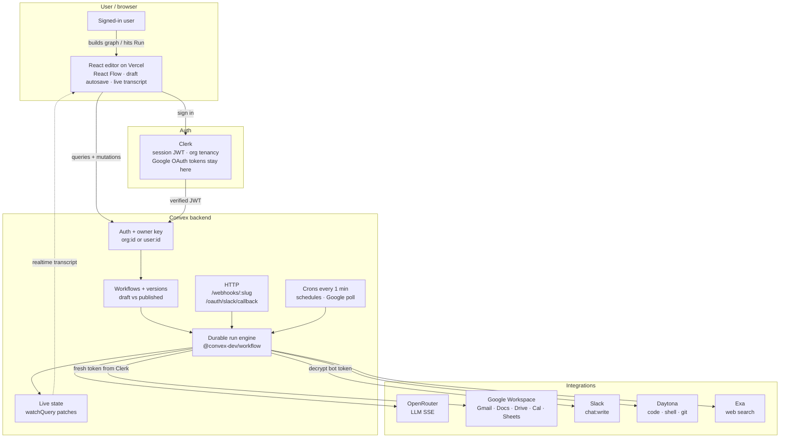
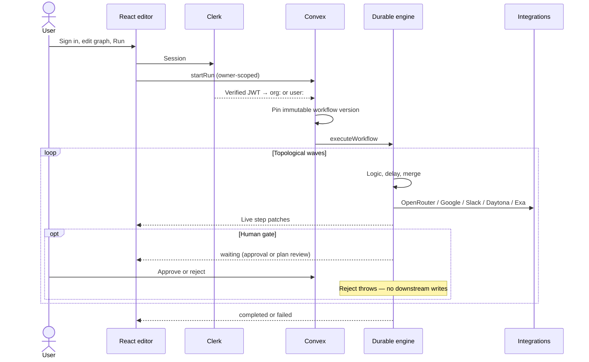
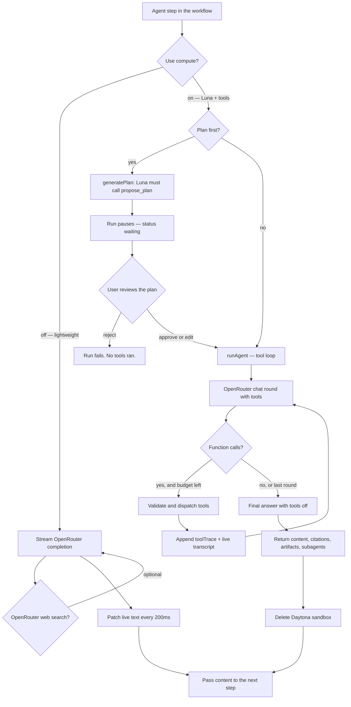
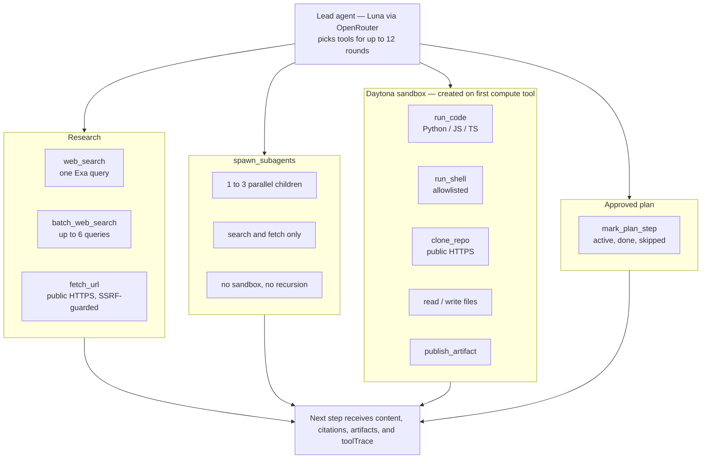

# OpenWorkflow architecture

User builds a graph in the browser. Convex runs it as a durable, owner-isolated workflow. Clerk holds identity and Google tokens. Slack, OpenRouter, Daytona, and Exa are called only from the backend.

The system diagram is rendered to [`openworkflow-architecture.png`](openworkflow-architecture.png):

```bash
bunx --bun @mermaid-js/mermaid-cli \
  -i docs/architecture-system.mmd \
  -o docs/openworkflow-architecture.png \
  -t neutral -b white -s 2 -w 2400 -H 1600 \
  -p docs/mermaid-puppeteer.json
```

## System: user, app, backend, integrations



## How a run works



## Ingress

| Who starts it | Which graph | Guard |
| --- | --- | --- |
| Manual Run in the editor | Current draft | Signed-in principal + active connection |
| Schedule cron (1 min) | Published, enabled | Owner copied from the workflow |
| `POST /webhooks/:slug` | Published, enabled | Server secret + 24h idempotency key |
| Google poll cron (1 min) | Published, enabled | Dedupe keys; first poll is baseline only |

Manual runs test the draft. Schedules, webhooks, and Google event triggers use the published version only.

## Agent step: how it works

An Agent node is either a lightweight OpenRouter completion or a compute agent with tools. Compute is on when `useCompute` is true. `planFirst` pauses the durable run until a human accepts (or edits) Luna's proposed plan.

Rendered: [`openworkflow-agent.png`](openworkflow-agent.png)

```bash
bunx --bun @mermaid-js/mermaid-cli \
  -i docs/architecture-agent.mmd \
  -o docs/openworkflow-agent.png \
  -t neutral -b white -s 2 -w 2400 -H 2000 \
  -p docs/mermaid-puppeteer.json
```



## Agent step: what it does

The lead agent chooses tools. Subagents can only research. Sandbox tools create one ephemeral Daytona VM (blocked network, 60 min TTL) and delete it when the step finishes.

Rendered: [`openworkflow-agent-tools.png`](openworkflow-agent-tools.png)

```bash
bunx --bun @mermaid-js/mermaid-cli \
  -i docs/architecture-agent-tools.mmd \
  -o docs/openworkflow-agent-tools.png \
  -t neutral -b white -s 2 -w 2400 -H 1600 \
  -p docs/mermaid-puppeteer.json
```



